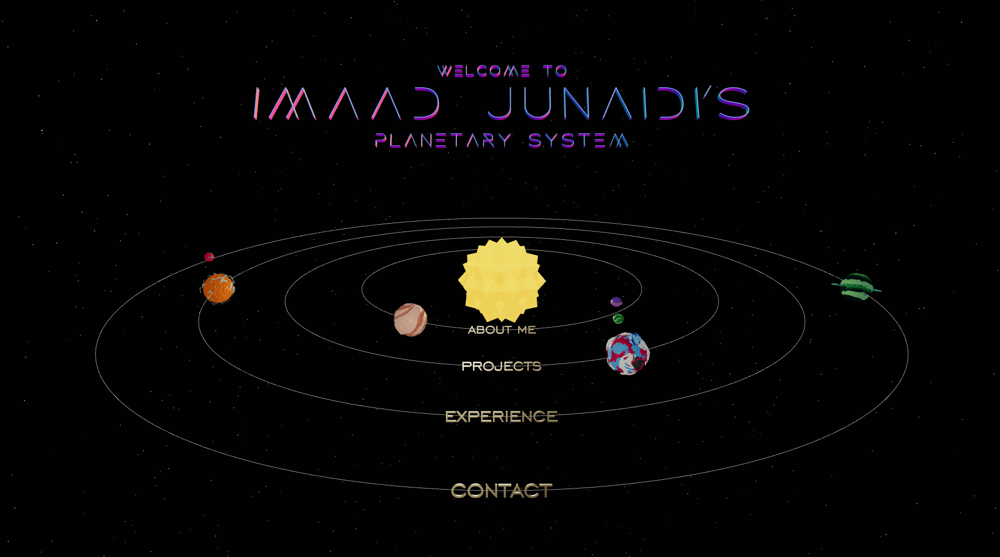

# Imaad Junaidi Portfolio Website
#### Built Using TypeScript, React.js, React-Three-Fiber, and Mantine

### About the Project

This portfolio website combines my love of astronomy with my love of software engineering. This is my first project using Three.js and it allowed me to learn plenty about 3-D graphics, including all the hassles of dealing with cameras and lighting. It is also my first solo project working with React.js, which has been a joy to use and has made frontend development infinitely more interesting to me. The website works by letting users navigate to each planet in the planetary system, those planets each representing some aspect of myself in regards to my profession. I combine the Three.js models with Mantine, to create a fluid and appealing user experience. Please enjoy learning more about me from my website! 

### Credits
- Sun by Poly by Google via Poly Pizza
- Planet Models by ithappy via CGTrader
- Loading Spinner by Punkichi.K via CodePen
